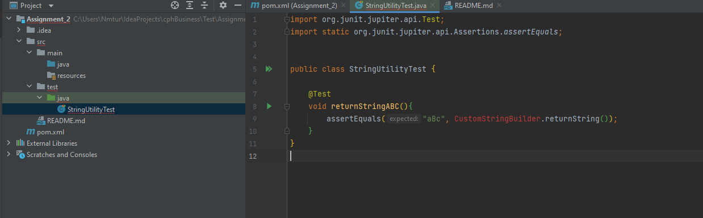
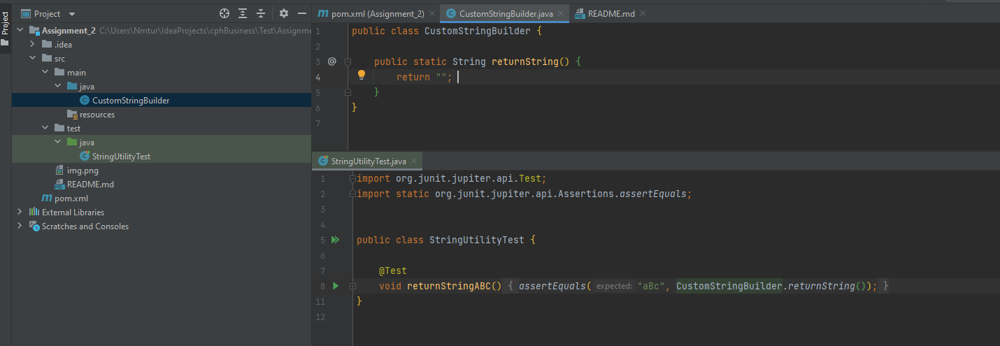
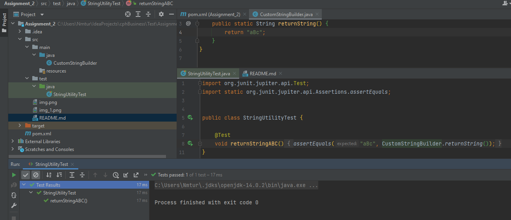
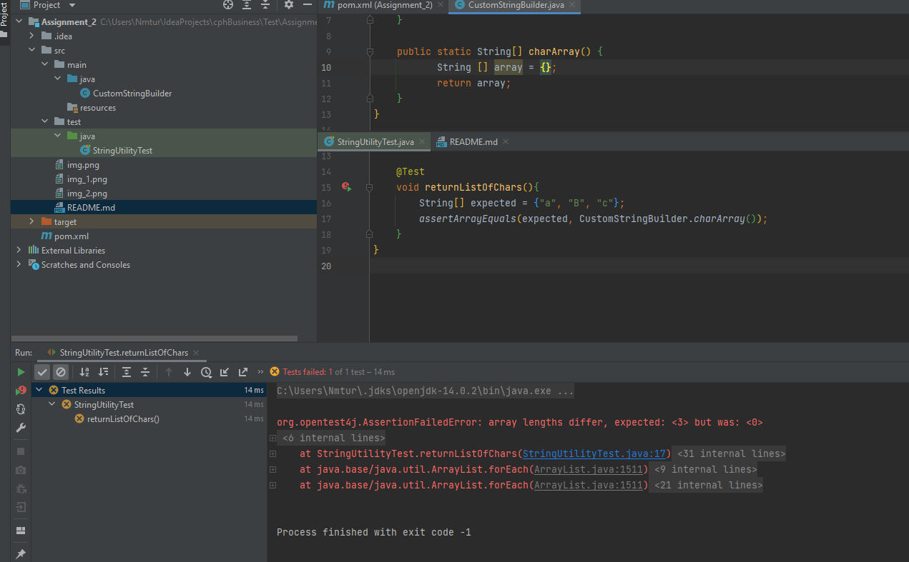
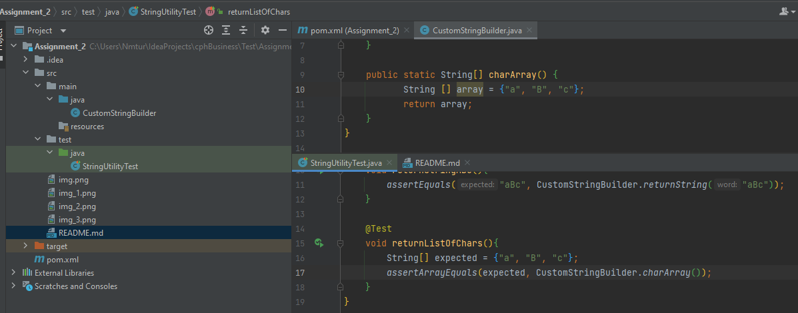
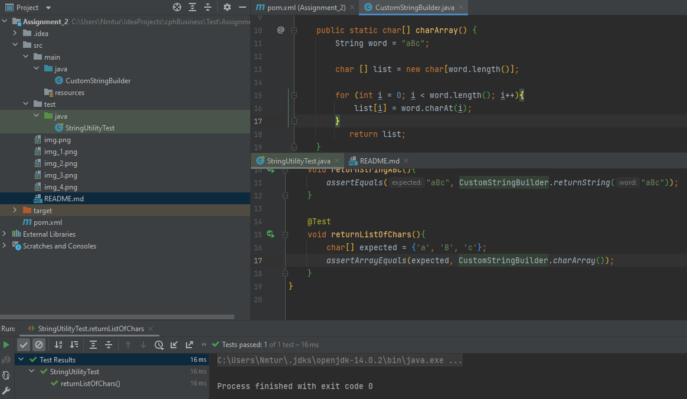
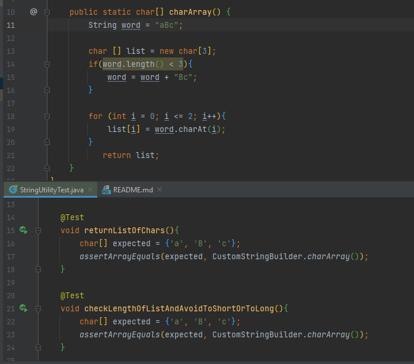

Assignment #2 in Test, By Nicholas Tureczek

1 - Reflection.
 
1.1\
Computer Mouse:\
\
The following tests are what I would preform on a computer mouse to ensure the highest quality.
First I would test every small part of the mouse individually. I.E the mouse wheel, is it sturdy, and the buttons, to check if the material is
good and doesn't easily break. - That might be the unit test of our mouse.\
Stress test of all the buttons, including the wheel, to see the durability of the components.
\
\
Test the optic laser to estimate the lifespan.\
\
Test the hardware and software combined. - Pressing one button and getting the expected result.
\
\
1.2\
Catastrophic failure\
In December 2008 Microsoft's Zune music player encounter a worldwide failure due to the internal clock in the system.
This was a result of the way the device handled a leap year. The problem was that it only handled 365 days, and not 366 which occurs
in a leap year. This resulted in a loop that never ended.\
TDD could have helped to prevent this by following the three laws of TDD:\
1. You must write a failing test before you write any production code.
2. You must not write more of a test than is sufficient to fail or fail to compile.
3. You must not write more production code than is sufficient to make the currently failing test pass.
\

A test of edge cases for the days could have also worked in this case, where we test what happens if 
go above 365 days or below. just to see how the program would react. If this had been done. The infinite 
loop that the Zune encountered, would have been spotted.\
\
\
2 - Two Katas\
2.1 String Utility\

First I Build the test that should return a simple string of "aBc". I create the CustomStringBuilder class through the test, which returns an empty string.

Then the test fails.\
Next I return the wanted string, and run the test to make sure that this is working as intended.

Next I want to return the letters of the string in a list.

First test fails, while I have given zero characters. This leeds to ideas about a new test we need to write later.

Figured that it was smarter to make t in a char Array 

\
Then I fixed the words if it was too short.
\

\
\
\
\
\
\
\
\

3.1 - JUnit 5

Investigate JUnit 5 (Jupiter). Explain the following, and how they are useful.

• @Tag\
The @Tag annotation is used to filter which test should be exercuted for a given test plan. - This means that you can chose to run some test, while others will be skipped.

• @Disabled\
Is used to disable entire classes. If the annotation @Disabled is applied at a class level, then all the tests methods 
in the given class will be disabled and not run.

• @RepeatedTest\
This annotation signals that the annotated method is a test template methode, that should be repeated a number of times. 
Each time the test is repeated, the test would behave as if the tag was @Test with the same lifecycle callbacks and extensions.
If one wishes to see the current number of repetitions this can be accessed by adding RepetitionInfo injection.

• @BeforeEach, @AfterEach\
This annotations determine whether a test should be run before or after any given test. This could be used if the test is dependent on some specific output.

• @BeforeAll, @AfterAll\
This is also to determine when the test should be run. Before all other tests, or after all other tests.

• @DisplayName\
@DisplayName is used to give tests a specific name, or an explaining name. This makes the test easier to find and read for others too.

• @Nested\
This is used to create a test hierarchy. This allows for a inner class in a test class.

• assumeFalse, assumeTrue\
Gives the opportunity to make a test within the test. To clarify, if you run a test that is dependent on a statement being true, but this isn't something that we can control.
We then dont want to run the test, if the statement is false. so the assumeTrue win terminate the test, given that the statement is false, but will continue the test if the required statement is true.
\
\
\
\
\
**Mocking Frameworks**\
\
**Mockito VS. EasyMock**

**Similaraties:**\
Both EasyMock and Mockito are open-source, java-based frameworks.
Both are typically used along with other test, like JUnit or TestNG\
Both follow Record-Replay-Verify patterns.
\
\
\
**Differences:**\
Mockito supports both mocking and spies, whereas EasyMock does not support spies.\
\
In Mockito, we use \
Mockito.when(mock.method(args)).thenReturn(value) \
method for mocking a method calls.
\
\
In EasyMock we use \
EasyMock.expect(mock.method(args)).andReturn(Value) \
method for mocking a method call.\
\
In Mockito, the Mockito.verify(mock).method(args) is used for verifying calls to a mock.\
\
In EasyMock, the EasyMock.verify(mock) is used for verifying calls to a mock, but this method is always used after
calling the EasyMock.replay(mock) method.\
\
In Mockito, throwing exception can be mocked using \
.thenThrow(ExceptionClass.class)\
after calling the Mockito.when(mock.method(args)) method.\
\
In EasyMock, throwing exception can be mocked using \
.andThrow(new ExceptionClass()) \
after calling the EasyMock.expect(..) method.
\
\
\
**Which one would you prefer, if any, and why?:**
Mockito would be my choice.
It seems to me that there are a lot more calls in EasyMock than in Mockito.
Everytime you call a methos in EasyMock, you have to run the following:\
\
EasyMock.replay(someService);\
SomeClass.someMethod(null);\
EasyMock.verify(someService);\
\
\
In Mockito you only have to use:\
SomeClass.someMethod(null);
Mockito.verifyZeroInteractions(someService);

